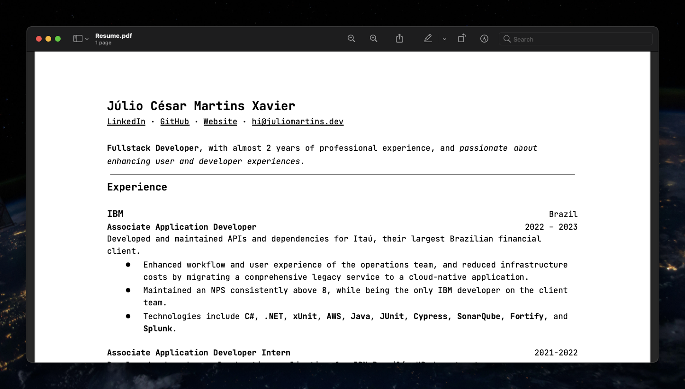

<h3 align="center">
    Resume
</h3>

<h6 align="center">
    <a href="https://juliomartins.dev" target="_blank">Portfolio</a>
    ·
    <a href="mailto:hi@juliomartins.dev" target="_blank">Email (hi@juliomartins.dev)</a>
</h6>

<h6 align="center">
	
</h6>

    Professional resume with templates both in English and Brazilian Portuguese.

    

&nbsp;

### ☁️ Download

- [Click here](../../raw/main/files/Resume.pdf) to download the PDF file.
- [Clique aqui](../../raw/main/files/Currículo.pdf) para baixar o arquivo PDF.

&nbsp;

### 📃 Template

- [Click here](../../raw/main/files/templates/Resume.docx) to download the Word template.
- [Clique aqui](../../raw/main/files/templates/Currículo.docx) para baixar o modelo do Word.

&nbsp;

---

	Copyright &copy; 2024 
	<a href="https://github.com/Superp0sit1on" target="_blank">
		Júlio Martins
	</a>

	

